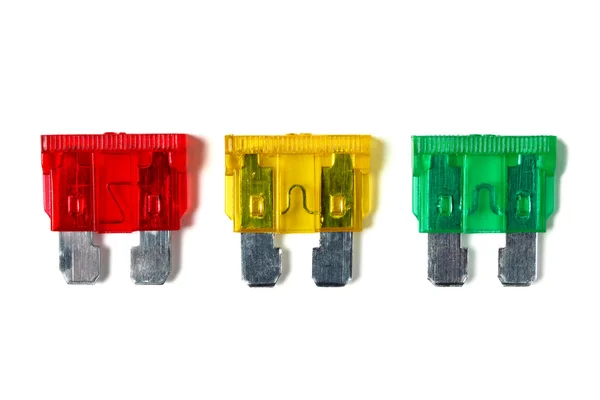

# ReqFuse

<object data="assets/logo.png" type="image/jpeg">
  
</object>

ReqFuse on Github https://github.com/carsdotcom/req_fuse

ReqFuse on Hex https://hex.pm/packages/req_fuse

ReqFuse on HexDocs https://hexdocs.pm/req_fuse

[](https://github.com/carsdotcom/req_fuse/actions/workflows/elixir.yml)


<!-- MDOC -->

[Req](https://github.com/wojtekmach/req) plugin for [`:fuse`](https://github.com/jlouis/fuse)

ReqFuse provides circuit-breaker (or load-shedding) functionality for HTTP requests that use the Req library.

## Usage

After adding the dependencies, simply attach the ReqFuse step to your request ensuring
you are passing in the required and any optional fuse configuration.

```elixir
Mix.install([
  {:req, "~> 0.3"},
  {:req_fuse, "~> 0.2"}
])

req_fuse_opts = [fuse_name: My.Example.Fuse]
req = [url: "https://httpstat.us/500", retry: :never]
|> Req.new()
|> ReqFuse.attach(req_fuse_opts)

# Fire the request enough times to melt the fuse
Enum.each(0..10, fn _ -> Req.request(req) end)
  => :ok
Req.request(req)
  => 08:45:42.518 [warning] :fuse circuit breaker is open; fuse = Elixir.My.Example.Fuse
  => {:error, %RuntimeError{message: "circuit breaker is open"}}
```

## Installation

If [available in Hex](https://hex.pm/docs/publish), the package can be installed
by adding `req_fuse` to your list of dependencies in `mix.exs`:

```elixir
def deps do
  [
    {:req_fuse, ">= 0.2.0"}
  ]
end
```

<!-- MDOC -->

## Twiddling the Knobs

  Attach the circuit-breaker :fuse step and configure the available options

### Fuse Options

  - `:fuse_melt_func` - A 1-arity function to determine if response should melt the fuse
    defaults to `ReqFuse.Steps.Fuse.melt?/1`
  - `:fuse_mode` - how to query the fuse, which has two values:
    - `:sync` - queries are serialized through the `:fuse_server` process (the default)
    - `:async_dirty` - queries check the fuse state directly, but may not account for recent melts or resets
  - `:fuse_name` - **REQUIRED** the name of the fuse to install
  - `:fuse_opts` The fuse _strategy_ options (see [fuse docs](https://hexdocs.pm/fuse/fuse.html#types) for reference) (order matters)
    See `ReqFuse.Steps.Fuse.defaults/0` for more information.
  - `:fuse_verbose` - If false, suppress Log output

See https://github.com/jlouis/fuse#tutorial for more information about the supported fuse
strategies and their options.

See also the additional discussion on options in `ReqFuse.Steps.Fuse`

## License

  See [LICENSE](https://github.com/carsdotcom/req_fuse/blob/main/LICENSE)

## Updates

  See [CHANGELOG.md](https://github.com/carsdotcom/req_fuse/blob/main/CHANGELOG.md)

  Updating the changelog. (Uses `auto-changelog`)
  https://github.com/cookpete/auto-changelog

  `auto-changelog --breaking-pattern "BREAKING CHANGE" --template keepachangelog  --commit-limit false --unreleased`

### Tagging by version in mix.exs

  ```
    git tag `grep -e '@version \"\d\.\d\.\d\".*' mix.exs | awk '{gsub(/"/, "", $2); print $2}'`
  ```
